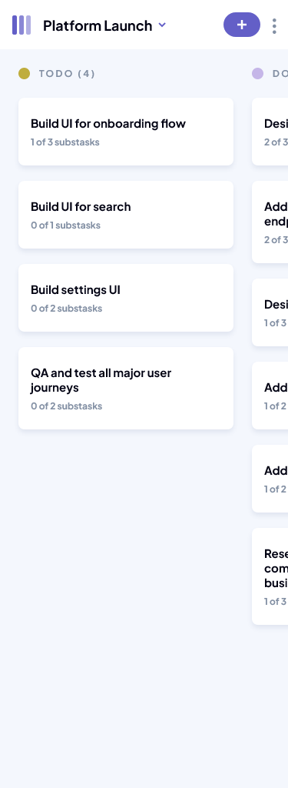
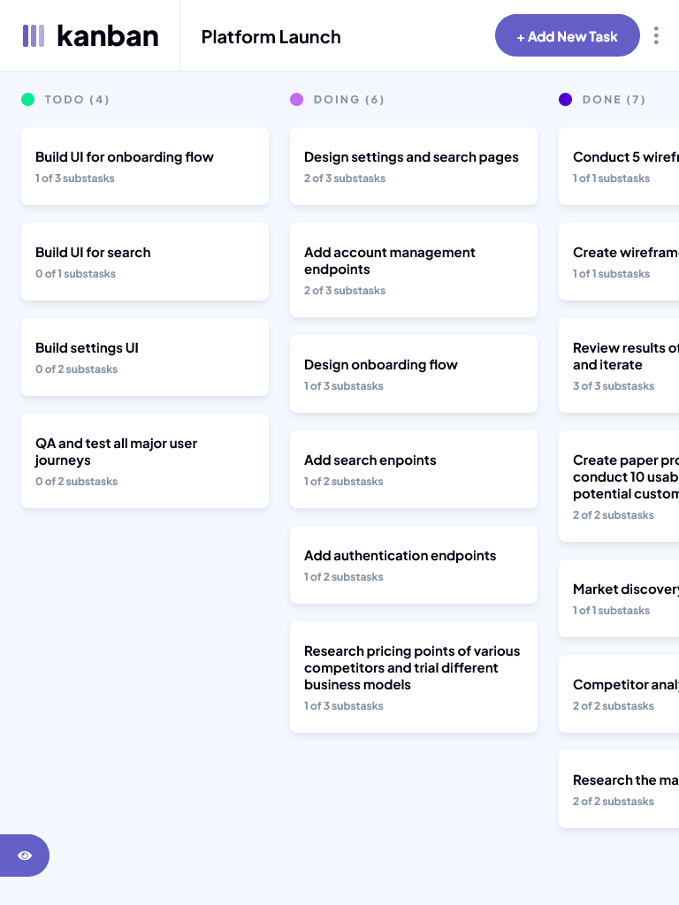
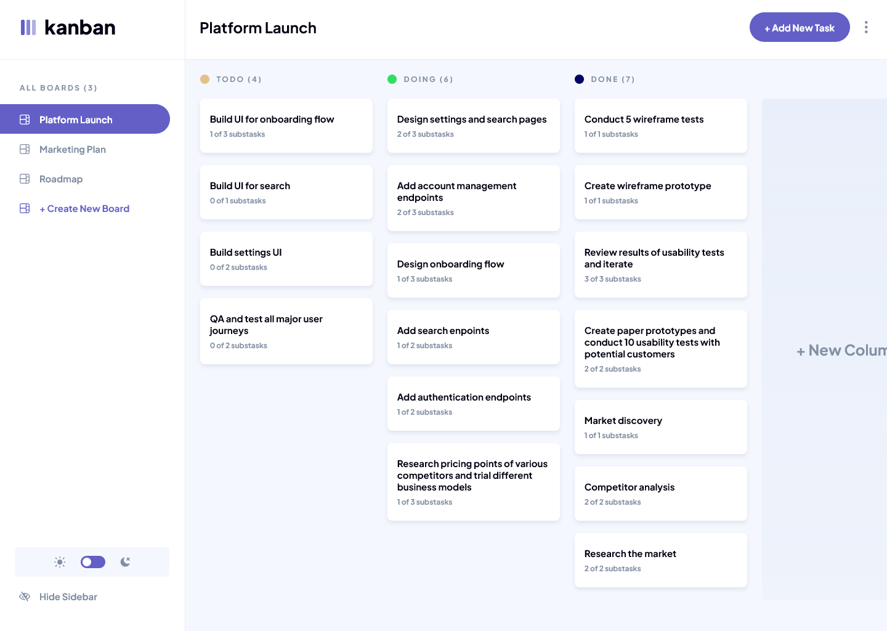

# Frontend Mentor - Kanban task management web app solution

This is a solution to the [Kanban task management web app challenge on Frontend Mentor](https://www.frontendmentor.io/challenges/kanban-task-management-web-app-wgQLt-HlbB). Frontend Mentor challenges help you improve your coding skills by building realistic projects. 

## Table of contents

- [Overview](#overview)
  - [The challenge](#the-challenge)
  - [Screenshot](#screenshot)
  - [Links](#links)
- [My process](#my-process)
  - [Built with](#built-with)
- [Author](#author)

## Overview

### The challenge

Users should be able to:

- [x] View the optimal layout for the app depending on their device's screen size
- [x] See hover states for all interactive elements on the page
- [x] Create, read, update, and delete boards and tasks
- [x] Receive form validations when trying to create/edit boards and tasks
- [x] Mark subtasks as complete and move tasks between columns
- [x] Hide/show the board sidebar
- [x] Toggle the theme between light/dark modes
- [x] **Bonus**: Allow users to drag and drop tasks to change their status and re-order them in a column
- [x] **Bonus**: Keep track of any changes, even after refreshing the browser (`localStorage` could be used for this if you're not building out a full-stack app)
- [x] **Bonus**: Build this project as a full-stack application

### Screenshot

#### Preview


#### Result Mobile



#### Result Desktop Tablet



#### Result Desktop



### Links

- Solution URL: [Repository GitHub](https://github.com/Samuel-Amaro/kanban-task-management-web-app)
- Live Site URL: [Result Live](https://samuel-amaro.github.io/kanban-web-app/)

## My process

### Built with

- Semantic HTML5 markup
- CSS(Flexbox, Grid)
- [Bem](https://getbem.com/introduction/) - Bem Metodolody CSS Architecture
- [Normalize](https://necolas.github.io/normalize.css/) - Normalize CSS
- Mobile-first workflow
- Responsive Web Design(RWD)
- WebAcessibility with arias attributers, and roles
- Typescript
- NPM
- [Vite](https://pt.vitejs.dev/) - Vite Tooling Front-End
- [React](https://reactjs.org/) - JS library
  - Hooks React, and Custom Hooks
  - Context API with reducers
  - [Immer](https://immerjs.github.io/immer/) - JS package
  - [Classnames](https://github.com/JedWatson/classnames) - JS utility
  - [Nano ID](https://github.com/ai/nanoid) - ID generator for JavaScript.
- [HTML Drag and Drop API](https://developer.mozilla.org/en-US/docs/Web/API/HTML_Drag_and_Drop_API) - HTML Drag and Drop API
- [LocalStorage Web API Browser](https://developer.mozilla.org/en-US/docs/Web/API/Web_Storage_API/Using_the_Web_Storage_API) - LocalStorage Web API Browser

## Author

- Website - [Portfolio Web Samuel](https://samuel-amaro.github.io/portfolio-web/)
- Frontend Mentor - [@samuel-amaro](https://www.frontendmentor.io/profile/Samuel-Amaro)

# Como usar o Tooling Front-End vite com react é typescript

### Criar projeto vite

```sh
npm create vite@latest
```

depois so seguir as instruções e escolher as opções de template fornecidas, de acordo com a necessidade do projeto.

### Instalar depêndencias

O vite não instala as dependencias somente as especifica, para instalar todas depencias e instalar a pasta node-modules para executar o projeto

```sh
npm install
```

### Executando o projeto no modo Dev

Apos instalar dependencias iniciais podemos iniciar nosso projeto e começar a trabalhar, iniciamos executando o servidor de desenvolvimento, rodar o projeto no modo de desenvolvimento

```sh
npm run dev
```

### Build para production

fazendo o build para produção

```sh
npm run build
```

### ESLint é Prettier

#### Instalar ESLint para checagem de tipos e encontrar problemas no codigo

instalar e configurar, apos executar o comando, so seguir as intruções, e escolher as opções que encaixam de acordo com as ferramentas que serão necessarias para seu projeto.

```sh
npm init @eslint/config
```

#### Plugins ESLint

eslint-plugin-jsx-a11y

Verificador AST estático para regras de acessibilidade em elementos JSX.

```sh
npm install eslint-plugin-jsx-a11y --save-dev
```

Uso

Você também pode habilitar todas as regras recomendadas ou estritas de uma só vez. Adicionar `plugin:jsx-a11y/recommended` ou `plugin:jsx-a11y/strict` em extends:

```sh
{
  "extends": ["plugin:jsx-a11y/recommended"]
}
```

#### Prettier

instale o Prettier localmente

```sh
npm install --save-dev --save-exact prettier
```

Em seguida, crie um arquivo de configuração vazio para permitir que os editores e outras ferramentas saibam que você está usando o Prettier:

```sh
echo {}> .prettierrc.json
```

Desativa todas as regras desnecessárias ou que possam entrar em conflito com o Prettier.

```sh
npm install --save-dev eslint-config-prettier
```

Em seguida, adicione `"prettier"` à matriz "extends" em seu `.eslintrc.*` arquivo. Certifique-se de colocá-lo por último, para que tenha a chance de substituir outras configurações.

```sh
{
  "extends": [
    "some-other-config-you-use",
    "prettier"
  ]
}
```

## Deploy e Build Para GitHub Pages 

Deploy e build para produção no GitHub Pages.

### Envie seu código para o repositório GitHub

Execute os seguintes comandos no seu Terminal

```sh 
  $ git init
```
```sh 
$ git add .
```
```sh 
$ git commit -m "first commit"
```
```sh 
$ git branch -M main
```
```sh 
$ git remote add origin http://github.com/username/repo-name.git
```
```sh 
$ git push -u origin main
``` 

Agora, você poderá ver seu código em seu repositório.

### Deployment (Static)

1. Vá para o seu ```vite.config.js``` arquivo. E adicione seu URL base a ele.

```javascript
export default defineConfig({
  plugins: [react()],
  base: "/repo-name/" //Aqui e o url base do website
})
```

2. Instalar package GitHub pages

```sh
npm install gh-pages --save-dev
``` 

3. adicionar à ```package.json```

```json
"homepage": "https://<username>.github.io/<repo>/",
...
"scripts": {
...
  "build": "vite build",
  "predeploy": "npm run build", //add esse script
  "deploy": "gh-pages -d dist", //add esse script
  ...
```

4. Opcional - Se for uma aplicação SPA - Single Page Apps for GitHub Pages usando react-router-dom

  * Copie o [404.html](https://github.com/rafgraph/spa-github-pages/blob/gh-pages/404.html) arquivo para o seu repositório como está.

    * Observe que, se você estiver configurando um site do Project Pages e não estiver usando um domínio personalizado (ou seja, o endereço do seu site é username.github.io/repo-name), será necessário definir pathSegmentsToKeep como 1 no 404.html arquivo para manter /repo-name o caminho após o redirecionamento. Se você estiver usando o React Router, precisará dizer a ele para usar o repo-name como o basename, por exemplo 
    ```jsx
      <BrowserRouter basename="/repo-name" />
    ```

  * Copie o [script de redirecionamento](https://github.com/rafgraph/spa-github-pages/blob/gh-pages/index.html#L21-L42) do ```index.html``` arquivo e adicione-o ao seu ```index.html``` arquivo - Observe que o script de redirecionamento deve ser colocado antes do script do aplicativo de página única em seu ```index.html``` arquivo.  

5. Por fim execute o comando

```sh
npm run deploy
```

